# NIV AI

NIV AI is a risk-aware home buying decision intelligence system for Indian
property buyers. It combines deterministic financial math, India-specific real
estate cost rules, behavioral bias detection, multi-agent AI reasoning, and
report generation to help a buyer answer one high-stakes question:

> Is this property financially safe to buy, or should I wait, renegotiate, or
> walk away?

The product is intentionally more conservative than a normal EMI calculator.
Most calculators answer "Can I afford the EMI?" NIV AI asks a harder set of
questions:

- What is the true acquisition cost after GST, stamp duty, registration, bank
  fees, legal verification, maintenance deposit, and property tax?
- Does the household survive realistic shocks such as job loss, income drop,
  emergency expense, and interest-rate increase?
- Will the bank likely reject the loan because fixed obligations are too high?
- Is the buyer emotionally committed, anchored, overconfident, or reacting to
  scarcity pressure?
- What safer price, down payment, or waiting period would make the decision
  defensible?

The repository contains a FastAPI backend, deterministic finance engines,
multi-agent AI orchestration, Firebase/Google Cloud integrations, and static
frontend assets for a Firebase-hosted web experience.

---

## Table of Contents

- [Product Summary](#product-summary)
- [Live Deployment](#live-deployment)
- [Core Capabilities](#core-capabilities)
- [Technology Stack](#technology-stack)
- [Repository Structure](#repository-structure)
- [System Diagrams](#system-diagrams)
- [Application Flow](#application-flow)
- [Backend Architecture](#backend-architecture)
- [AI Agent Architecture](#ai-agent-architecture)
- [Data Model](#data-model)
- [API Surface](#api-surface)
- [Configuration](#configuration)
- [Local Development](#local-development)
- [Testing](#testing)
- [Deployment](#deployment)
- [Security Model](#security-model)
- [Cost Model](#cost-model)
- [Roadmap](#roadmap)

---

## Product Summary

NIV AI is designed for Indian households evaluating a residential property
purchase. The primary user is a prospective home buyer who has a specific
property in mind and wants a structured, bias-resistant decision audit before
committing capital.

The application turns buyer inputs into:

- a clear buy/wait/avoid verdict,
- a monthly EMI and affordability profile,
- an India-specific hidden cost breakdown,
- bank underwriting risk indicators,
- stress-test survivability,
- behavioral bias flags,
- a multi-section decision report,
- and post-analysis actions such as a counter-offer letter or bank inquiry
  draft.

The system separates arithmetic from AI interpretation. Financial calculations
are deterministic Python functions. LLM agents consume those computed numbers
and produce structured explanations, challenges, and final narratives.

---

## Live Deployment

- Frontend: `https://elegant-verbena-494508-a-e207e.web.app`
- Observed live frontend assets: `index.html`, `app.html`, `style.css`,
  `app.js`
- Observed live API base in deployed `app.js`:
  `https://niv-ai-216564346797.asia-south1.run.app`
- Repository Firebase Hosting configuration serves the `frontend` directory.

> Note: the deployed application appears more complete than some checked-in
> frontend files in this repository snapshot. The backend source and local
> prototype still document the intended FastAPI, Firebase, deterministic engine,
> and multi-agent architecture.

---

## Core Capabilities

### Buyer Intake

- Income and spouse/co-borrower income
- Existing EMIs and monthly expenses
- Liquid savings and down payment
- Property price, area, configuration, location, builder, possession date
- RERA and GST identifiers where available
- Property readiness status
- Loan tenure and expected interest rate
- Optional behavioral checklist and user notes

### Deterministic Financial Analysis

- EMI calculation using standard amortization
- EMI-to-income ratio
- Post-EMI surplus
- 12-month cash flow projection
- Savings depletion month
- Safe property price and maximum property price thresholds
- Total interest payable
- FOIR underwriting check
- Building age / LTV risk where construction year is provided

### India-Specific Cost Engine

- GST slab classification:
  - ready-to-move: 0 percent
  - affordable under-construction: 1 percent
  - standard under-construction: 5 percent
- State and district-level stamp duty
- Female buyer stamp duty concession where applicable
- Registration fee
- Maintenance deposit
- Bank processing fee
- Legal / technical verification fee
- Annual municipal property tax estimate

### Stress Testing

- Base case
- 30 percent income drop
- 6-month job loss
- 2 percent interest-rate hike
- INR 5 lakh emergency expense
- Scenario-level survivability, buffer months, severity, and breaking point

### AI Reasoning

- Behavioral analysis agent
- Validation agent
- Presentation agent
- Context continuity agent
- Conversation agent
- Roundtable agents:
  - Marcus: financial analyst
  - Zara: risk strategist
  - Soren: behavioral economist
- Decision synthesizer for the final verdict and audit
- Brochure analyzer using Gemini Vision for property document extraction

### Reporting and Actions

- Verdict and confidence
- Primary reasons and key warnings
- Safe price recommendation
- Suggested actions
- Chart-ready data for dashboards
- PDF report generation
- GCS signed URLs for report access
- Comparison and what-if analysis patterns

---

## Technology Stack

| Layer | Technology | Purpose |
|---|---|---|
| Frontend | HTML, CSS, JavaScript | Static web app, wizard, report UI, charts |
| Hosting | Firebase Hosting | CDN-backed static frontend hosting |
| Backend | FastAPI | HTTP and WebSocket API layer |
| Runtime | Python 3.11, Uvicorn | Backend execution |
| Validation | Pydantic | Typed request and response schemas |
| AI | Google Generative AI SDK | Gemini 2.0 Flash agent calls |
| Local AI fallback | Ollama | Local model path for development |
| Database | Firestore | User sessions, inputs, simulation results, verdicts |
| Storage | Google Cloud Storage | PDF report storage and signed URLs |
| PDF | ReportLab | Report rendering |
| Auth | Firebase Auth, Firebase Admin SDK | Token verification and scoped data access |
| Deployment | Docker, Cloud Run | Containerized backend deployment |

---

## Repository Structure

```text
NIV-AI/
|-- backend/
|   |-- main.py                         # FastAPI routes and app bootstrap
|   |-- schemas/
|   |   `-- schemas.py                  # Pydantic models and response contracts
|   |-- engines/
|   |   |-- compute.py                  # Headless deterministic calculation bundle
|   |   |-- india_defaults.py           # India-specific acquisition cost engine
|   |   `-- pdf_generator.py            # ReportLab PDF rendering
|   |-- agents/
|   |   |-- base_agent.py               # Gemini/Ollama routing, JSON parsing, retries
|   |   |-- deterministic/              # Pure Python finance and risk modules
|   |   |-- ai_reasoning/               # Behavioral, brochure, synthesizer agents
|   |   |-- validation/                 # Assumption and conflict validation
|   |   |-- presentation/               # Chart/report presentation model builder
|   |   |-- context_interaction/         # Follow-up conversation and context state
|   |   `-- orchestration/              # Central orchestrator
|   |-- roundtable/                     # Multi-agent discussion engine
|   |-- firebase/                       # Firebase Admin and Firestore operations
|   |-- storage/                        # GCS upload and signed URL helpers
|   |-- auth/                           # Firebase token verification middleware
|   |-- integration_test.py
|   `-- test_deterministic.py
|-- frontend/
|   |-- index.html
|   |-- dashboard.html
|   |-- onboarding.html
|   |-- history.html
|   |-- compare.html
|   |-- impact.html
|   |-- niv-ai .html                    # Older standalone prototype
|   |-- css/
|   `-- js/
|-- Dockerfile
|-- firebase.json
|-- firestore.rules
|-- requirements.txt
`-- README.md
```

---

## System Diagrams

The diagrams below are intentionally detailed and presentation-ready. They can
be rendered directly by GitHub or exported to PNG/SVG from any Mermaid renderer
for slide decks.

### 1. Product Context Diagram

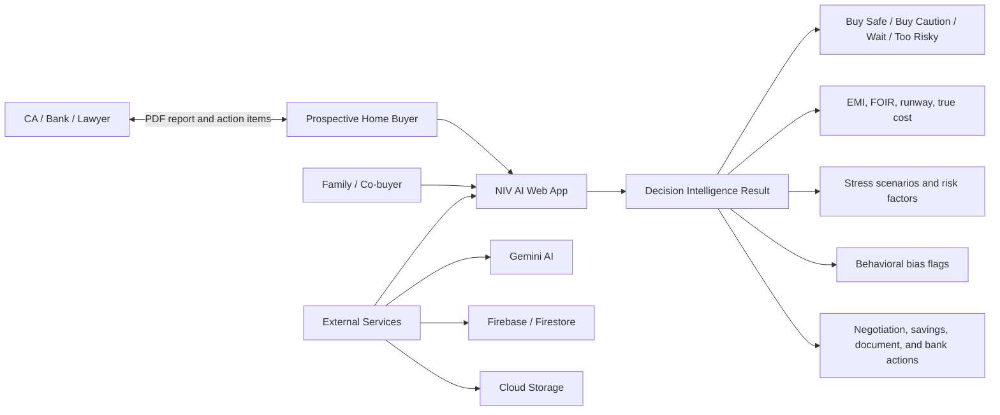

### 2. End-to-End User Journey

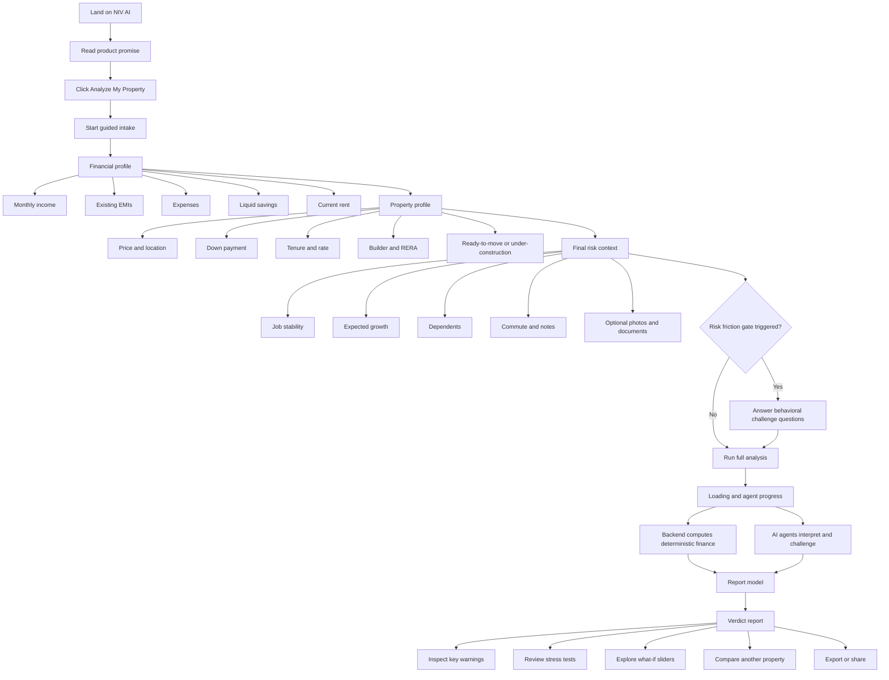

### 3. Use Case Diagram

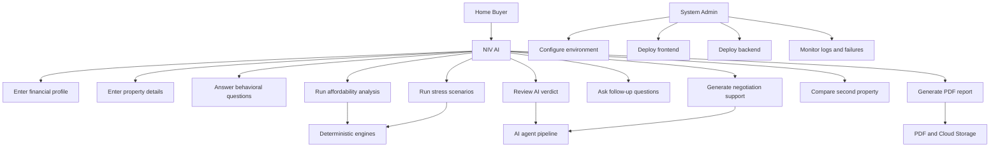

### 4. High-Level Architecture

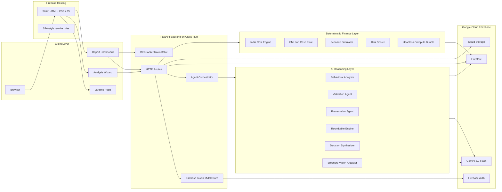

### 5. Backend Request Sequence

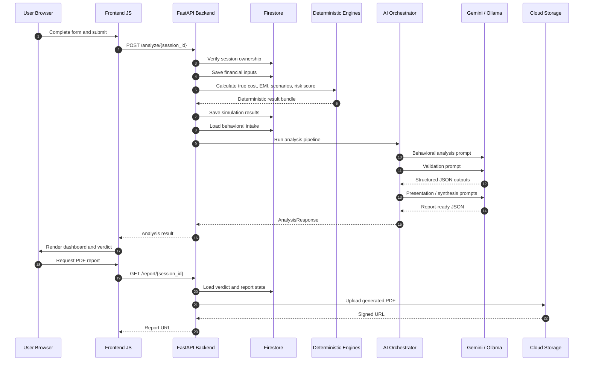

### 6. Deterministic Finance Pipeline

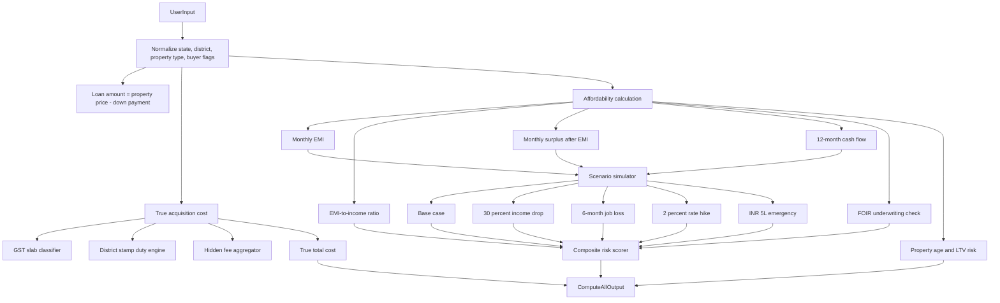

### 7. AI Agent Pipeline

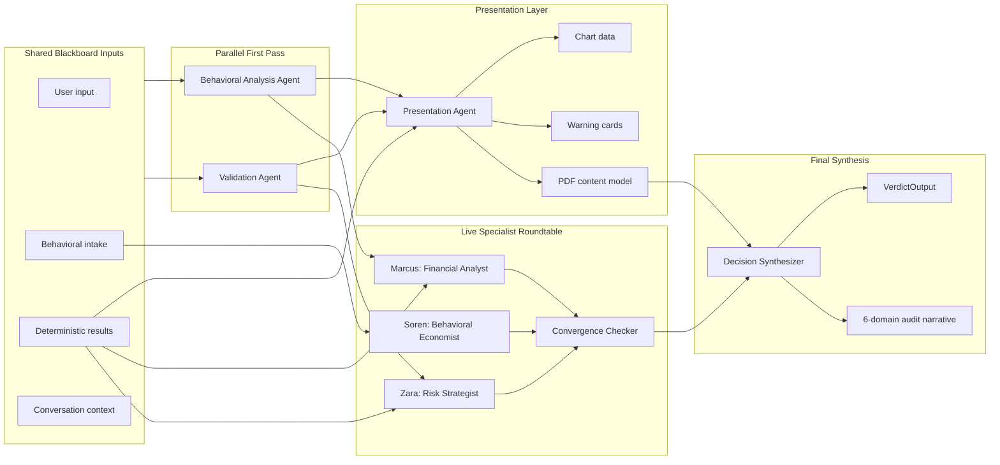

### 8. Roundtable State Machine

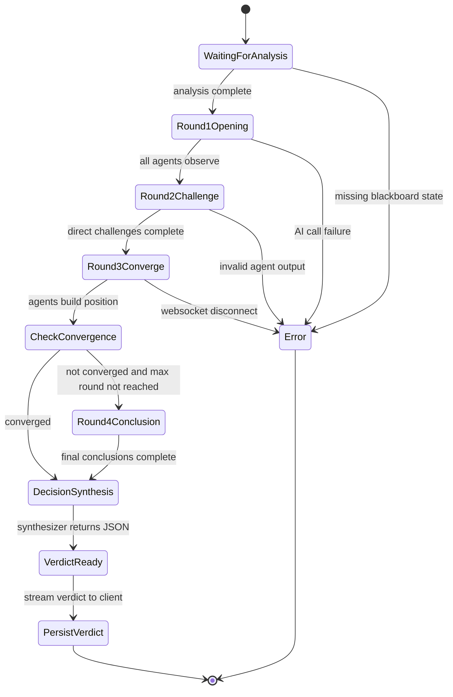

### 9. Firestore Data Model

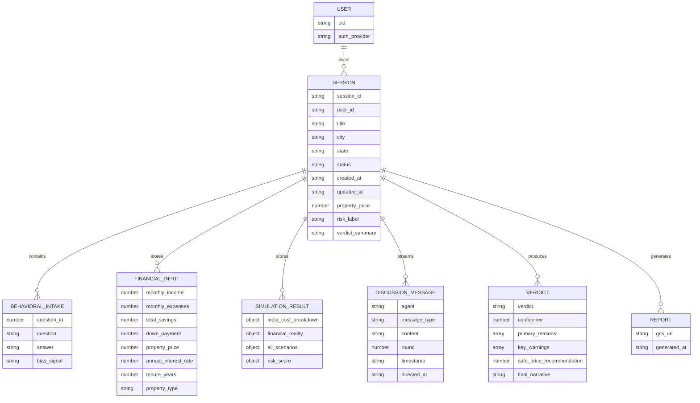

### 10. API Map

```mermaid
flowchart TB
    Client["Frontend Client"] --> Health["GET /health"]
    Client --> Calc["POST /api/v1/calculate"]
    Client --> SessionStart["POST /session/start"]
    Client --> SessionGet["GET /session/{session_id}"]
    Client --> History["GET /session/history/{user_id}"]
    Client --> Behavioral["POST /behavioral/{session_id}"]
    Client --> Analyze["POST /analyze/{session_id}"]
    Client --> Brochure["POST /analyze/brochure/{session_id}"]
    Client --> Conversation["POST /conversation/{session_id}"]
    Client --> Roundtable["WS /roundtable/{session_id}"]
    Client --> Report["GET /report/{session_id}"]

    Calc --> PureMath["No-auth deterministic math path"]
    SessionStart --> Auth["Firebase auth required"]
    SessionGet --> Auth
    History --> Auth
    Behavioral --> Auth
    Analyze --> Auth
    Brochure --> Auth
    Conversation --> Auth
    Roundtable --> Auth
    Report --> Auth

    Analyze --> FullPipeline["Financial math + AI orchestration"]
    Brochure --> Vision["Gemini Vision extraction"]
    Roundtable --> Streaming["Live agent discussion stream"]
    Report --> PDF["PDF generation + signed URL"]
```

### 11. Deployment Topology

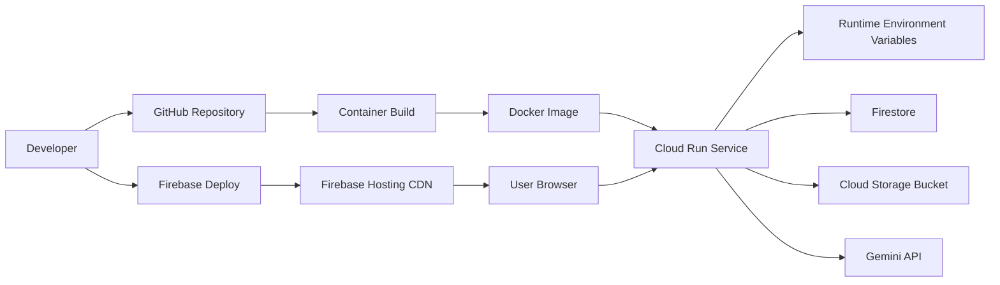

### 12. Security and Access Control Flow

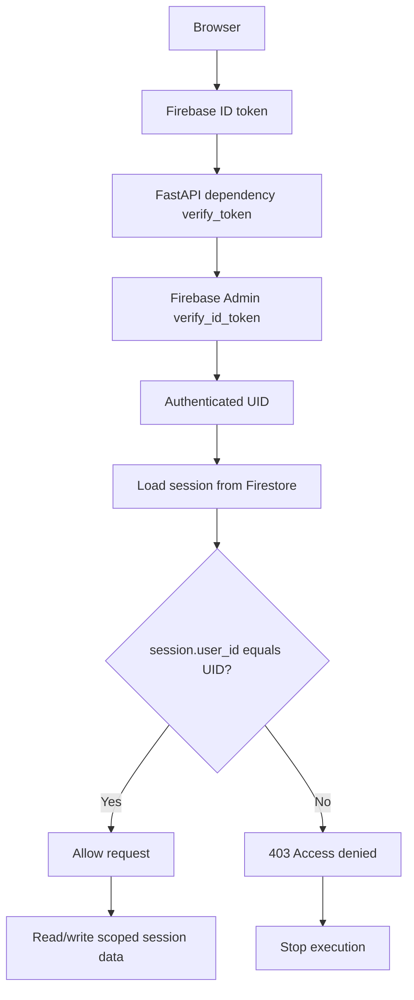

### 13. Cost Model Diagram

```mermaid
flowchart TB
    Cost["Operating Cost Drivers"] --> Hosting["Firebase Hosting"]
    Cost --> API["Cloud Run"]
    Cost --> DB["Firestore"]
    Cost --> Storage["Cloud Storage"]
    Cost --> AI["Gemini API"]
    Cost --> Messaging["WhatsApp / integrations"]

    Hosting --> H1["Bandwidth"]
    Hosting --> H2["Stored frontend assets"]

    API --> A1["Request count"]
    API --> A2["CPU and memory duration"]
    API --> A3["Cold starts and concurrency"]

    DB --> D1["Document reads"]
    DB --> D2["Document writes"]
    DB --> D3["Stored reports metadata"]

    Storage --> S1["PDF object storage"]
    Storage --> S2["Signed URL downloads"]

    AI --> G1["Prompt tokens"]
    AI --> G2["Output tokens"]
    AI --> G3["Vision/document calls"]

    Messaging --> M1["WhatsApp template sends"]
    Messaging --> M2["Third-party service fees"]
```

---

## Application Flow

### Landing Page

The deployed landing page positions NIV AI as a Mumbai-first home buying
decision engine. It emphasizes:

- deterministic math,
- stress testing,
- behavioral challenge,
- a six-agent pipeline,
- RERA and property intelligence,
- and post-analysis services.

### Analysis Wizard

The analysis app collects a structured buyer profile across three broad stages:

1. Financial profile
   - monthly income,
   - spouse/co-borrower income,
   - liquid savings,
   - existing EMIs,
   - expenses,
   - rent.

2. Property details
   - property price,
   - location,
   - down payment,
   - tenure,
   - interest rate,
   - carpet area,
   - readiness,
   - builder,
   - RERA and GST identifiers.

3. Final risk context
   - job stability,
   - expected growth,
   - dependents,
   - commute distance,
   - property and financial notes,
   - optional document/photo uploads.

### Behavioral Friction Gate

Before submitting risky inputs, the frontend can ask additional behavioral
questions. This is meant to surface hidden commitment bias, FOMO, delay
tolerance, liquidity awareness, and job-loss preparedness.

### Analysis Output

The report presents:

- verdict,
- confidence,
- risk reasons,
- computed numbers,
- stress-test outcomes,
- property signals,
- hidden costs,
- blind spots,
- path-to-safe recommendations,
- and export/share actions.

---

## Backend Architecture

The FastAPI backend is intentionally thin at the route layer. Route handlers
validate authentication and ownership, convert request bodies into Pydantic
models, call deterministic engines and orchestrator methods, then return typed
responses.

Key backend responsibilities:

- initialize Firebase Admin,
- initialize the AI orchestrator,
- validate Firebase tokens,
- enforce session ownership,
- persist session state,
- run deterministic calculations,
- call AI agents,
- stream roundtable messages,
- generate PDF reports,
- upload reports to GCS.

### Important Backend Modules

| File | Responsibility |
|---|---|
| `backend/main.py` | FastAPI app, routes, startup, CORS, session and report APIs |
| `backend/schemas/schemas.py` | All request/response Pydantic models |
| `backend/engines/compute.py` | One-call deterministic calculation bundle |
| `backend/engines/india_defaults.py` | GST, stamp duty, registration, hidden fees |
| `backend/agents/deterministic/financial_reality.py` | EMI, surplus, FOIR, cash flow, LTV risk |
| `backend/agents/deterministic/scenario_simulation.py` | Stress scenarios |
| `backend/agents/deterministic/risk_scorer.py` | Composite risk score |
| `backend/agents/orchestration/orchestrator.py` | Central AI pipeline controller |
| `backend/roundtable/discussion_engine.py` | Live specialist discussion flow |
| `backend/firebase/firestore_ops.py` | Firestore CRUD helpers |
| `backend/storage/gcs_client.py` | PDF upload and signed URLs |

---

## AI Agent Architecture

All text-based agents inherit from `BaseAgent`, which centralizes:

- prompt assembly,
- Gemini/Ollama routing,
- retry handling,
- JSON extraction,
- invalid JSON recovery,
- streaming support.

### Model Routing

`USE_OLLAMA=true`

- Uses local Ollama.
- Default model: `llama3.2:3b`.
- Useful for local testing without API spend.
- Produces leaner outputs where needed.

`USE_OLLAMA=false`

- Uses Gemini 2.0 Flash through the Google Generative AI SDK.
- Intended for production-grade multi-agent and full-audit generation.
- Brochure analysis always uses Gemini Vision because there is no equivalent
  local multimodal path in the current codebase.

### Blackboard Pattern

The orchestrator uses a per-session blackboard as the shared state container.
This lets agents reason over a single evolving state instead of passing large
custom payloads between every step.

The blackboard includes:

- user inputs,
- behavioral intake,
- deterministic results,
- behavioral analysis,
- validation output,
- presentation output,
- roundtable transcript,
- final verdict,
- active flags,
- open questions.

---

## Data Model

Core domain models live in `backend/schemas/schemas.py`.

Important model groups:

- input models:
  - `UserInput`,
  - `BehavioralIntake`,
  - `ConversationMessage`.
- deterministic outputs:
  - `IndiaCostBreakdown`,
  - `FinancialRealityOutput`,
  - `ScenarioOutput`,
  - `AllScenariosOutput`,
  - `RiskScoreOutput`.
- AI outputs:
  - `BehavioralAnalysisOutput`,
  - `ValidationOutput`,
  - `PresentationOutput`,
  - `VerdictOutput`.
- session and report outputs:
  - `SessionStartResponse`,
  - `AnalysisResponse`,
  - `ReportOutput`.

---

## API Surface

### Health

```http
GET /health
```

Returns service health, service name, and version.

### Headless Deterministic Calculate

```http
POST /api/v1/calculate
```

Runs deterministic calculations only. This endpoint is designed for fast
frontend recalculation and can be used for sliders, comparison tools, and
batch testing without LLM spend.

### Session Management

```http
POST /session/start
GET /session/{session_id}
GET /session/history/{user_id}
```

Creates and retrieves authenticated user sessions.

### Behavioral Intake

```http
POST /behavioral/{session_id}
```

Stores behavioral questionnaire answers for the session.

### Full Analysis

```http
POST /analyze/{session_id}
```

Runs:

1. financial input persistence,
2. India cost calculation,
3. affordability calculation,
4. scenario simulation,
5. risk scoring,
6. behavioral analysis,
7. validation,
8. presentation generation,
9. analysis response assembly.

### Brochure Analysis

```http
POST /analyze/brochure/{session_id}
```

Accepts image or PDF property brochure uploads and uses Gemini Vision to
extract structured property details.

Supported MIME types:

- `image/jpeg`
- `image/png`
- `image/webp`
- `image/heic`
- `application/pdf`

### Conversation

```http
POST /conversation/{session_id}
```

Handles follow-up questions after analysis and decides which agents need to
rerun based on the user's natural-language update.

### Roundtable Streaming

```http
WS /roundtable/{session_id}?token={firebase_id_token}
```

Streams a live multi-agent discussion and sends a final verdict event when the
decision synthesizer completes.

### PDF Report

```http
GET /report/{session_id}
```

Generates or retrieves a PDF report, uploads it to Cloud Storage, and returns a
signed URL.

---

## Configuration

Create a `.env` file from `.env.example`.

```bash
cp .env.example .env
```

Required groups:

### Gemini

```env
GEMINI_API_KEY=your_gemini_api_key_here
USE_OLLAMA=false
```

For local-only AI testing:

```env
USE_OLLAMA=true
OLLAMA_BASE_URL=http://localhost:11434
OLLAMA_MODEL=llama3.2:3b
```

### Firebase

```env
FIREBASE_PROJECT_ID=your_firebase_project_id
FIREBASE_PRIVATE_KEY_ID=your_private_key_id
FIREBASE_PRIVATE_KEY=your_private_key
FIREBASE_CLIENT_EMAIL=your_client_email
FIREBASE_CLIENT_ID=your_client_id
GOOGLE_APPLICATION_CREDENTIALS=serviceAccountKey.json
```

### Google Cloud Storage

```env
GCS_BUCKET_NAME=your_gcs_bucket_name
GCS_PROJECT_ID=your_gcp_project_id
```

### App URLs

```env
FRONTEND_URL=http://localhost:3000
BACKEND_URL=http://localhost:8000
PORT=8080
```

### Auth

```env
JWT_SECRET_KEY=your_jwt_secret_key_minimum_32_characters
JWT_ALGORITHM=HS256
JWT_EXPIRY_HOURS=24
```

---

## Local Development

### 1. Create a Python environment

```bash
python -m venv .venv
source .venv/bin/activate
```

### 2. Install dependencies

```bash
pip install -r requirements.txt
```

### 3. Configure environment

```bash
cp .env.example .env
```

Edit `.env` with Firebase, GCS, and AI settings.

### 4. Start the backend

From the `backend` directory:

```bash
uvicorn main:app --reload --host 0.0.0.0 --port 8000
```

### 5. Serve the frontend

The repository uses Firebase Hosting for static assets. For a quick local
static preview, serve the `frontend` folder with any static file server.

Example:

```bash
python -m http.server 3000 --directory frontend
```

Then open:

```text
http://localhost:3000
```

---

## Testing

The repository includes deterministic and integration-style tests:

```bash
python backend/test_deterministic.py
python backend/integration_test.py
```

Recommended additional validation:

- run `/health`,
- run `/api/v1/calculate` with a sample `UserInput`,
- test Firebase token verification,
- test Firestore session creation,
- test GCS report upload in a staging bucket,
- test one Gemini-backed agent path with `USE_OLLAMA=false`,
- test one local model path with `USE_OLLAMA=true`.

---

## Deployment

### Backend: Cloud Run

The `Dockerfile` builds a Python 3.11 container and starts Uvicorn:

```dockerfile
FROM python:3.11-slim
WORKDIR /app
COPY requirements.txt .
RUN pip install --no-cache-dir -r requirements.txt
COPY . .
ENV PORT=8080
CMD ["uvicorn", "main:app", "--host", "0.0.0.0", "--port", "8080"]
```

Cloud Run should be configured with:

- `PORT=8080`,
- Firebase service account credentials,
- Gemini API key,
- GCS bucket configuration,
- frontend CORS origin,
- appropriate memory and timeout settings for AI calls.

### Frontend: Firebase Hosting

`firebase.json` points hosting at the `frontend` directory and rewrites all
routes to `index.html`.

```json
{
  "hosting": {
    "public": "frontend",
    "rewrites": [
      {
        "source": "**",
        "destination": "/index.html"
      }
    ]
  }
}
```

Deploy with:

```bash
firebase deploy --only hosting
```

---

## Security Model

### Authentication

Authenticated endpoints use Firebase ID token verification through Firebase
Admin. The backend extracts the user UID and checks that the requested session
belongs to that UID.

### Authorization

Session reads and writes are scoped by `user_id`. If a user attempts to access
another user's session, the API returns `403 Access denied`.

### Firestore Rules

The included Firestore rules restrict session access to authenticated users
where `session.user_id == request.auth.uid`. Discussion messages inherit the
same session ownership constraint.

### File Upload Guardrails

Brochure upload handling validates:

- MIME type,
- max file size,
- session existence,
- session ownership.

### AI Output Guardrails

The agent base class instructs models to return strict JSON, retries failures,
and extracts JSON from imperfect LLM output. Deterministic calculations are
never delegated to the LLM.

---

## Cost Model

The main operating cost drivers are:

- Cloud Run request volume and CPU/memory duration,
- Firestore reads and writes,
- Cloud Storage report files and egress,
- Firebase Hosting bandwidth,
- Gemini input/output tokens,
- Gemini Vision calls for brochures or documents,
- any WhatsApp or third-party messaging integrations.

### Estimated Build Cost Breakdown

These are implementation estimates for a production hardening or rebuild effort.
They are not cloud operating charges.

| Workstream | Scope | Estimate USD |
|---|---|---:|
| Product discovery and architecture | workflows, data model, risk framework | 2,000-4,000 |
| Frontend app | landing page, wizard, report UI, what-if tools | 5,000-9,000 |
| Backend APIs | FastAPI, validation, report APIs, tool endpoints | 5,000-10,000 |
| Deterministic finance engine | EMI, FOIR, hidden costs, stress scenarios | 3,000-6,000 |
| AI agent pipeline | prompts, orchestration, Gemini integration | 4,000-8,000 |
| Firebase/GCP integration | hosting, Firestore, Cloud Run, GCS, auth | 2,000-4,000 |
| QA, security, deployment | testing, rate limits, monitoring, CI/CD | 2,000-5,000 |
| Total | MVP-to-production range | 23,000-46,000 |

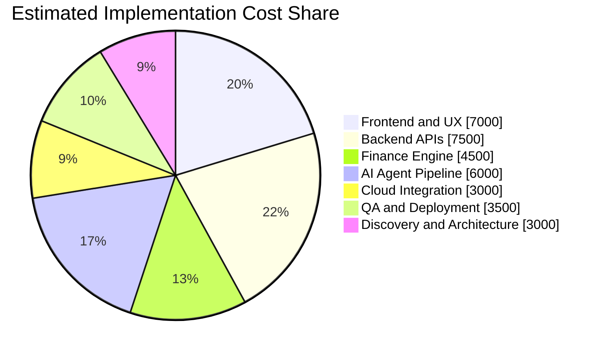

---

## Roadmap

Potential next improvements:

- align checked-in frontend assets with the deployed `app.html` and `app.js`,
- add OpenAPI examples for every endpoint,
- add CI for deterministic tests and schema validation,
- add frontend build/deployment documentation,
- add staged Firebase/Cloud Run deployment environments,
- add rate limiting and quota protection for AI-heavy endpoints,
- add durable roundtable transcript replay in the UI,
- add stronger document parsing validation for RERA, EC, and loan letters,
- add automated PDF snapshot tests,
- add observability for agent latency, token usage, and failure modes.

---

## Disclaimer

NIV AI is an informational decision-support tool. It does not replace a
SEBI-registered financial advisor, lawyer, chartered accountant, bank loan
officer, or licensed property professional. Users should independently verify
all financial, legal, tax, and property assumptions before making a purchase.
